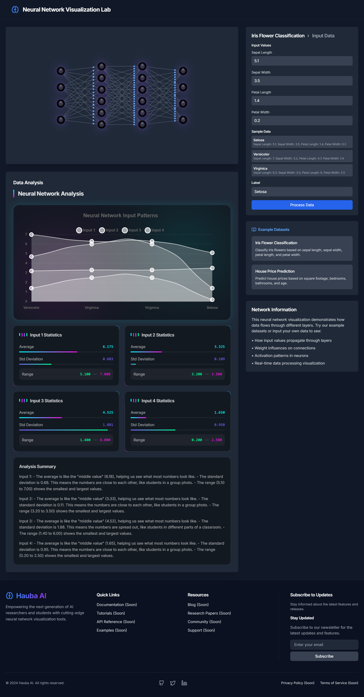

# Neural Network Visualization Lab

<p align="center">
  
</p>

A sophisticated React-based application for visualizing and understanding neural networks in real-time. Built with modern web technologies, this tool helps AI researchers and students better comprehend neural network behavior through interactive visualizations.

## 🌐 Live Demo

Explore the application live at: [https://analyzer.bhagatnikhil.com.np/](https://analyzer.bhagatnikhil.com.np/)

---

## 🌟 Features

- **Interactive Neural Network Visualization**
  - Real-time network state updates
  - Animated data flow visualization
  - Interactive neuron inspection
  - Weight and connection visualization

- **Data Input & Analysis**
  - Multiple input formats support
  - Pre-built example datasets
  - Real-time data processing
  - Statistical analysis visualization

- **Educational Tools**
  - Built-in example datasets
  - Comprehensive tutorials
  - Interactive learning scenarios
  - Detailed network information

## 🚀 Tech Stack

- React 18
- TypeScript
- Tailwind CSS
- Framer Motion
- Chart.js
- Lucide Icons
- Vite

## 📦 Installation

1. Clone the repository:
```bash
git clone https://github.com/yourusername/neural-network-visualization.git
cd neural-network-visualization
```

2. Install dependencies:
```bash
npm install
```

3. Start the development server:
```bash
npm run dev
```

4. Build for production:
```bash
npm run build
```

## 🔧 Configuration

The application is configured using Vite and supports various environment configurations. Key configuration files:

- `vite.config.ts` - Vite configuration
- `tailwind.config.js` - Tailwind CSS configuration
- `tsconfig.json` - TypeScript configuration

## 🎨 Customization

### Network Architecture

The neural network architecture can be customized in the `networkGenerator.ts` file:

```typescript
// Modify these parameters to change the network structure
const layers = 4;
const neuronsPerLayer = [4, 6, 6, 4];
```

### Styling

The application uses Tailwind CSS for styling. Global styles are defined in `src/index.css`.

## 📚 Usage Examples

### Basic Usage

```typescript
import { NeuralNetwork } from './components/NeuralNetwork';

function App() {
  return (
    <NeuralNetwork
      inputData={{
        values: [0.5, 0.3, 0.8, 0.2],
        label: "Sample Input"
      }}
    />
  );
}
```

### Using Example Datasets

The application comes with pre-built example datasets:
- Iris Flower Classification
- House Price Prediction

## 🤝 Contributing

Contributions are welcome! Please feel free to submit a Pull Request. For major changes, please open an issue first to discuss what you would like to change.

1. Fork the repository
2. Create your feature branch (`git checkout -b feature/AmazingFeature`)
3. Commit your changes (`git commit -m 'Add some AmazingFeature'`)
4. Push to the branch (`git push origin feature/AmazingFeature`)
5. Open a Pull Request

## 📄 License

This project is licensed under the MIT License - see the [LICENSE](LICENSE) file for details.

## 🙏 Acknowledgments

- React Team for the amazing framework
- Framer Motion for smooth animations
- Chart.js for data visualization
- Lucide for beautiful icons

## 📞 Contact

- Website: [Nikhil Bhagat](https://nikhilbhagat.com.np/)
- GitHub: [@NikeGunn](https://github.com/NikeGunn)
- linkedin: [@Nikhil Bhagat](https://www.linkedin.com/in/bhagatnikhil/)

---

Made with ❤️ by [Nikhil Bhagat] 